# Call Charts

Hover any TypeScript/JavaScript function to see its call flow as a chart, right inside the tooltip.
Expand into a full-size interactive graph with execution tracing and per-function details.

<p align="center">
  
</p>

## Demo Video: 
https://x.com/imwaleed_ahmad/status/2085135115001221261

## Install 
https://marketplace.visualstudio.com/items?itemName=waleed.call-charts

## Features

**Hover chart** — hovering a function name renders a layered flow chart of everything it calls
(3 levels deep), color-coded by layer: components, services, data/store, utils. Library calls are
collapsed out of the chart so only your code's structure remains. Click the chart to open the
interactive view.

**Expand view** — a full-size, zoomable graph of the same flow:

- Click any node to jump to its definition.
- Hover a node to trace its execution path: packets flow from the outermost callers, through the
  current function, to the node under your cursor; the active path lights up in layer colors while
  everything else dims.
- A details card slides out under the hovered node: signature, call-site arguments (**in**),
  return expressions (**out**), early exits (**guards**), state writes (**mutates**), callers by
  name (**called by**), and the last commit that touched the function (**git**).
- "Show parents" button under the current function loads the caller side on demand.

All analysis is deterministic and local: the editor's own call-hierarchy provider, light source-text
extraction, and `git log -L`. No AI, no network.

## Settings

| Setting               | Default | Description                                                    |
| --------------------- | ------- | -------------------------------------------------------------- |
| `callCharts.maxWidth` | `820`   | Max rendered hover-chart width (px) before scaling down.       |
| `callCharts.maxHeight`| `380`   | Max rendered hover-chart height (px) before scaling down.      |
| `callCharts.minScale` | `0.5`   | Lower bound on downscaling; below this the hover scrolls.      |
| `callCharts.animation`| `true`  | Staggered reveal and flow-packet animation.                    |

## Development

```bash
npm install
npm run compile        # typecheck + build to out/
npm run lint           # eslint (extension, webview script, tests)
npm run format:check   # prettier
npm test               # unit tests (layout, extractors, graph model)
npm run test:e2e       # drives the expand view in headless Chromium
npm run package        # build the .vsix
npm run install:local  # install the .vsix into the editor on PATH
```

The e2e suite needs a browser once: `npx playwright install chromium`.

## Limitations

- Resolution quality follows the TypeScript language server: dynamic dispatch and template-bound
  handlers (e.g. Angular `(click)` bindings) don't appear as calls.
- Nodes inside the hover tooltip are not clickable (editor hovers render static markdown); use the
  expand view for navigation.
